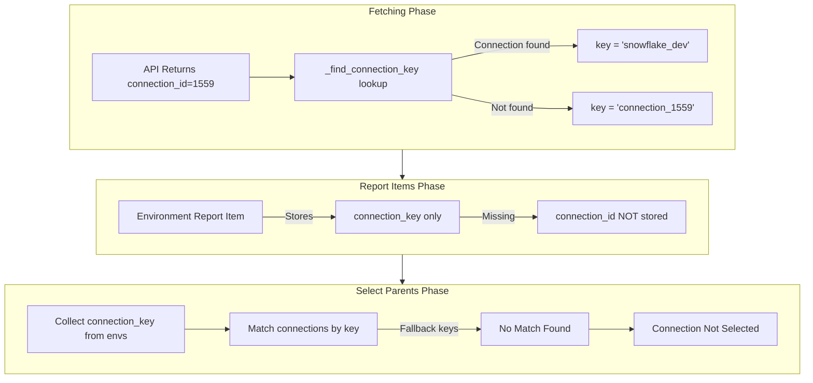
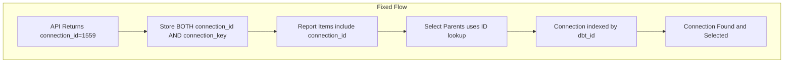

# Connection ID-Based Dependency Resolution

## Problem Statement

When selecting entities for migration, environments fail to auto-select their parent connections because the lookup uses string keys instead of numeric IDs. This results in:

- Environments with `connection_key: "connection_1559"` (fallback format)
- No matching connection with `key: "connection_1559"` in the globals
- YAML output contains unresolved `LOOKUP:connection_1559` placeholders
- Terraform plan shows `connection_id = (known after apply)` instead of linking to existing connections

## Root Cause Analysis



## Solution Architecture

Store `connection_id` alongside `connection_key` throughout the data pipeline, and use ID-based lookups for connection dependency resolution.



## Files to Modify

| File | Change |

|------|--------|

| [importer/models.py](importer/models.py) | Add `connection_id` field to Environment model |

| [importer/fetcher.py](importer/fetcher.py) | Store `connection_id` when building Environment |

| [importer/element_ids.py](importer/element_ids.py) | Include `connection_id` in environment report items |

| [importer/web/components/hierarchy_index.py](importer/web/components/hierarchy_index.py) | Add connection ID-to-mapping lookup index |

| [importer/web/pages/scope.py](importer/web/pages/scope.py) | Use ID-based connection lookup in Select Parents |

| [importer/web/pages/mapping.py](importer/web/pages/mapping.py) | Use ID-based connection lookup in Select Parents |

## Implementation Details

### 1. Add `connection_id` to Environment Model

In [importer/models.py](importer/models.py) line 143-154:

```python
class Environment(ImporterBaseModel):
    key: str
    id: Optional[int] = None
    name: str
    type: str
    connection_key: str
    connection_id: Optional[int] = None  # NEW: Store original API connection ID
    credential: Optional[Credential] = None
    # ... rest unchanged
```

### 2. Store `connection_id` During Fetch

In [importer/fetcher.py](importer/fetcher.py) around line 543-549, update Environment construction:

```python
Environment(
    id=env_item.get("id"),
    name=env_item["name"],
    type=env_item.get("type", "development"),
    connection_key=connection_key,
    connection_id=connection_id,  # NEW: Store the original ID
    credential=credential,
    # ... rest unchanged
)
```

### 3. Include `connection_id` in Report Items

In [importer/element_ids.py](importer/element_ids.py) around line 113-126:

```python
for env in project.get("environments", []):
    env_mapping_id = _register(
        records,
        env,
        "ENV",
        name=env.get("name"),
        extra={
            "project_key": project.get("key"),
            "project_name": project_name,
            "parent_project_id": project_mapping_id,
            "connection_key": env.get("connection_key"),
            "connection_id": env.get("connection_id"),  # NEW
        },
    )
```

### 4. Add Connection ID Index to HierarchyIndex

In [importer/web/components/hierarchy_index.py](importer/web/components/hierarchy_index.py):

Add new index field around line 96:

```python
# Connection ID -> Mapping ID (for ID-based lookups)
self._connection_by_id: Dict[int, str] = {}
```

Populate it around line 143-146:

```python
if entity_type == "CON":
    conn_key = entity.get("key")
    conn_dbt_id = entity.get("dbt_id")
    if conn_key:
        self._connection_by_key[conn_key] = mapping_id
    if conn_dbt_id:
        self._connection_by_id[conn_dbt_id] = mapping_id  # NEW
```

Add lookup method:

```python
def get_connection_by_id(self, connection_id: int) -> Optional[str]:
    """Get connection mapping ID by dbt Cloud connection ID."""
    return self._connection_by_id.get(connection_id)
```

### 5. Update Select Parents Logic

In both [importer/web/pages/scope.py](importer/web/pages/scope.py) (lines 1130-1144) and [importer/web/pages/mapping.py](importer/web/pages/mapping.py) (lines 1143-1157):

**Before:**

```python
# 4. Find and select connections referenced by selected environments
used_connection_keys = set()
for env_id in selected_env_ids:
    env_item = item_by_id.get(env_id)
    if env_item:
        conn_key = env_item.get("connection_key")
        if conn_key:
            used_connection_keys.add(conn_key)

for item in report_items:
    if item.get("element_type_code") == "CON":
        conn_key = item.get("key")
        if conn_key in used_connection_keys:
            selection_manager.set_selected(item.get("element_mapping_id"), True, auto_save=False)
```

**After:**

```python
# 4. Find and select connections referenced by selected environments
# Use connection_id for reliable lookups (key matching is fallback)
used_connection_ids = set()
used_connection_keys = set()

for env_id in selected_env_ids:
    env_item = item_by_id.get(env_id)
    if env_item:
        conn_id = env_item.get("connection_id")
        conn_key = env_item.get("connection_key")
        if conn_id:
            used_connection_ids.add(conn_id)
        elif conn_key:
            # Fallback to key matching if no ID
            used_connection_keys.add(conn_key)

for item in report_items:
    if item.get("element_type_code") == "CON":
        conn_dbt_id = item.get("dbt_id")
        conn_key = item.get("key")
        # Match by ID first, then by key as fallback
        if conn_dbt_id and conn_dbt_id in used_connection_ids:
            selection_manager.set_selected(item.get("element_mapping_id"), True, auto_save=False)
        elif conn_key and conn_key in used_connection_keys:
            selection_manager.set_selected(item.get("element_mapping_id"), True, auto_save=False)
```

## Testing Plan

### Unit Tests

1. **Model test**: Verify Environment model accepts and serializes `connection_id`
2. **Fetcher test**: Verify `connection_id` is captured from API response
3. **Element IDs test**: Verify report items include `connection_id` for environments
4. **Hierarchy Index test**: Verify `get_connection_by_id()` returns correct mapping

### Integration Tests

1. **Fetch test**: Fetch real account, verify environment report items have both `connection_key` and `connection_id`
2. **Select Parents test**: Select a project, verify referenced connections are auto-selected even with fallback keys

### Manual E2E Test Scenarios

| Scenario | Steps | Expected Result |

|----------|-------|-----------------|

| Fresh fetch with existing connections | Fetch account, select project, click "Select Parents" | All referenced connections selected |

| Connection with fallback key | Fetch account where connection was deleted but env still references it | Connection ID logged as warning, no crash |

| Backward compatibility | Load existing report_items.json without connection_id | Falls back to key-based matching |

## Backward Compatibility

- Existing `report_items.json` files won't have `connection_id` 
- The new logic checks for `connection_id` first, then falls back to `connection_key` matching
- No migration needed for existing data

## Risk Assessment

| Risk | Mitigation |

|------|------------|

| Existing snapshots missing `connection_id` | Fallback to key-based matching |

| Performance impact of dual indexing | Negligible - dictionary lookups are O(1) |

| Breaking changes to API | `connection_id` is Optional, defaults to None |

## Rollout

1. Implement and test locally
2. Update version to 0.12.5
3. Add CHANGELOG entry
4. Test with real migration scenario (SFDPS deployment)