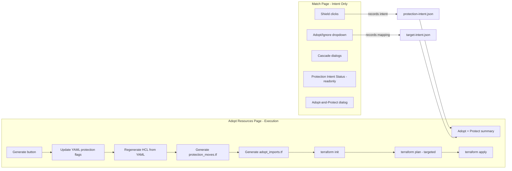

# Consolidate Adopt + Protect Execution onto Adopt Resources Page

## Problem

Protection generation and terraform execution is split across three pages:

- **Match page** (`match.py` lines 3190-4035): "Generate Protection Changes", terraform init/plan/apply, protection_moves.tf, HCL regeneration
- **Adopt page** (`adopt.py` lines 354-658): adopt plan/apply, adopt_imports.tf, state rm
- **Utilities page** (`utilities.py` lines 316-541): "Generate All Pending", protection_moves.tf (no terraform)

This causes constant breakage because a change in one page's generation logic (e.g., targeting, moved blocks, import blocks) conflicts with another page's assumptions.

## Target Architecture

## What Stays on Match Page

All intent recording and display. No changes needed to these sections:

- `on_row_change()` protection toggle logic (lines 1359-1630)
- `apply_protection()` / `remove_protection()` bulk intent (lines 1202-1357)
- Cascade dialogs (lines 1028-1117)
- Adopt intent recording in grid dropdowns (lines 671-965)
- `_adopt_and_protect_from_match()` dialog (lines 1437-1513)
- Protection Intent Status panel (lines 2609-3190) -- **read-only display only**
- "Needs Clarification" section with per-resource Protect/Unprotect buttons (lines 2832-2927)
- "Pending Intents" section with Undo buttons (lines 3022-3079)

## What Gets Removed from Match Page

All generation and terraform execution:

- `start_generate_protection_changes()` and `do_generate_work()` (lines 3190-3656)
- "Generate Protection Changes" / "Generate All Pending" button (lines 3661-3673)
- Terraform Commands expansion panel (lines 3675-4035): init, plan, apply buttons and handlers
- Target flag computation from intents + protection_moves.tf + adopt_imports.tf (lines 3686-3753)

Replace the "Generate" button with a "Continue to Adopt & Apply" navigation button that goes to the Adopt page.

## What Gets Added to Adopt Page

Move and merge the generation/execution logic from match.py into adopt.py. The Adopt page already has its own plan/apply flow -- we extend it to also handle protection.

### Unified Generation Flow (new `_run_unified_generate()`)

Merge match.py's `do_generate_work()` (lines 3248-3635) with adopt.py's plan phases:

1. **Read pending intents** -- protection intents from `protection_intent_manager` (both `needs_tf_move` and `get_pending_yaml_updates()`)
2. **Read adopt rows** -- from grid/confirmed_mappings with `action="adopt"`
3. **Update YAML** -- apply protection flags via `apply_protection_from_set()` / `apply_unprotection_from_set()`, then merge baseline
4. **Regenerate HCL** -- `YamlToTerraformConverter.convert()` from updated YAML
5. **Generate protection_moves.tf** -- `generate_repair_moved_blocks()` for resources with protection changes that are already in TF state
6. **Generate adopt_imports.tf** -- `write_adopt_imports_file()` for resources being adopted (already exists in adopt.py line 461)
7. **Mark intents applied to YAML** -- `mark_applied_to_yaml()`

### Unified Plan/Apply Flow (extend existing `_run_adopt_plan()` / `_run_adopt_apply()`)

The adopt page already has plan/apply (lines 354-658). Extend it:

- **Target flags**: Merge addresses from both `adopt_imports.tf` AND `protection_moves.tf` (same logic as match.py lines 3686-3753)
- **Post-apply**: Mark protection intents as applied to TF state via `mark_applied_to_tf_state()`
- **Cleanup**: Remove `adopt_imports.tf` and optionally `protection_moves.tf` after successful apply

### Adopt Page Summary Panel

Extend `_compute_adopt_summary()` (line 289) to also show:

- Resources pending protection changes (move between protected/unprotected blocks)
- Resources pending adoption + protection (import directly into protected block)
- Clear breakdown: "N resources to adopt, M resources to move (protection), K resources to adopt + protect"

## What Happens to Utilities/Protection Management Page

Keep it as a **read-only status + manual override** page:

- Protection status display (current behavior)
- Intent editing (change intent, undo)
- Audit history (current behavior)
- Remove or disable "Generate All Pending" button (that logic moves to Adopt page)

## Key Files to Modify

1. **[importer/web/pages/match.py](importer/web/pages/match.py)**: Remove lines 3190-4035 (generation + terraform). Add "Continue to Adopt" button.
2. **[importer/web/pages/adopt.py](importer/web/pages/adopt.py)**: Add unified generate flow, extend plan/apply with protection targeting, extend summary panel.
3. **[importer/web/pages/utilities.py](importer/web/pages/utilities.py)**: Remove "Generate All Pending" button or redirect to Adopt page.
4. **[importer/web/components/match_grid.py](importer/web/components/match_grid.py)**: No changes needed (grid rendering stays the same).

## Key Shared Utilities (no changes needed)

- `protection_intent.py` -- `ProtectionIntentManager` (intent CRUD)
- `protection_manager.py` -- `generate_repair_moved_blocks()`, `detect_protection_mismatches()`, `write_moved_blocks_file()`
- `terraform_import.py` -- `write_adopt_imports_file()`, `generate_adopt_imports_from_grid()`

## Migration Notes

- The `_target_flags` computation logic currently in match.py (lines 3686-3753) should be extracted into a shared utility function (e.g., in `protection_manager.py` or a new `terraform_targeting.py`) so the adopt page can reuse it without duplication.
- The `_get_terraform_env()` and `_get_terraform_dir()` helpers already exist in both match.py and adopt.py -- consolidate into a shared utility.
- The `do_generate_work()` async function from match.py contains the most complete generation logic (YAML update, HCL regen, moved blocks, adopt imports update, intent marking). This is the primary source to port into adopt.py's generation flow.

