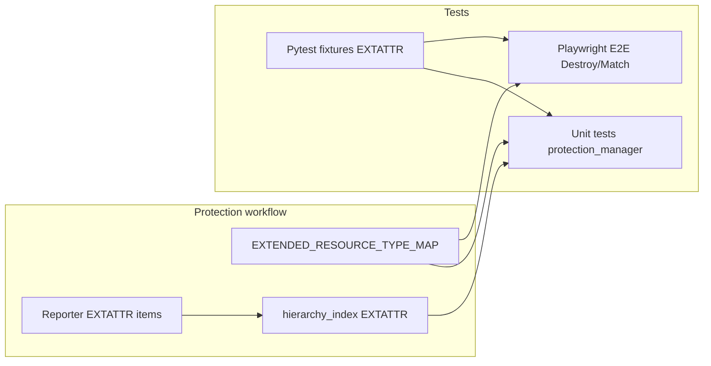

# Extended Attributes: Next Steps and Test/Protection Gaps

## Answers to your questions

### 1. Does the plan include comprehensive pytest fixtures of all types, plus Playwright UI tests?

**No.** The current PRD ([prd/41.01-Extended-Attributes-Support.md](prd/41.01-Extended-Attributes-Support.md)) does **not** explicitly require:

- **Comprehensive pytest fixtures of all types**  
The PRD “Test Fixtures” section (lines 554–559) only lists three fixtures: `extended_attributes_sample.json`, `environment_with_extended_attributes.json`, `extended_attributes_config.yml`. It does not require fixtures that cover **all resource types** (PRJ, REP, PREP, ENV, JOB, **EXTATTR**) for protection workflows—e.g. YAML with `extended_attributes` (protected and unprotected), Terraform state with `dbtcloud_extended_attributes` (protected/unprotected blocks), protection-intent JSON including EXTATTR, or report items with `element_type_code: EXTATTR` for hierarchy/cascade tests.
- **Playwright UI tests**  
The PRD calls out “Web UI Tests” under `importer/web/tests/` (unit/component tests) and “End-to-End Fetch” / “Terraform” integration tests. It does **not** explicitly require **Playwright E2E** tests for extended attributes (e.g. Destroy page showing “Extended Attributes” in the resource list and type filter, unprotect/moved-block flows for EXTATTR, or Match page protection checkbox for extended attributes). The existing E2E suite ([test/e2e/test_destroy_protection.py](test/e2e/test_destroy_protection.py), [test/e2e/test_match_protection.py](test/e2e/test_match_protection.py)) does not yet include EXTATTR in fixtures or assertions.

So the **current plan/PRD does not include** “comprehensive pytest fixtures of all types” or “Playwright UI tests” as explicit requirements. The plan below adds both.

---

### 2. Is extended attributes supported by the protection workflow?

**Partially.** What works today vs what’s missing:

| Area                        | Status            | Notes                                                                                                                                                                                                                                                                                                                                                                                                                                                                                                                                                                                                                                |
| --------------------------- | ----------------- | ------------------------------------------------------------------------------------------------------------------------------------------------------------------------------------------------------------------------------------------------------------------------------------------------------------------------------------------------------------------------------------------------------------------------------------------------------------------------------------------------------------------------------------------------------------------------------------------------------------------------------------ |
| Extract / detect            | Supported         | [importer/web/utils/protection_manager.py](importer/web/utils/protection_manager.py): `RESOURCE_TYPE_MAP` includes EXTATTR; `extract_protected_resources` and `detect_protection_changes` / `build_protection_map` handle EXTATTR (composite key `project_key_ext_key`).                                                                                                                                                                                                                                                                                                                                                             |
| Destroy page                | Supported         | [importer/web/pages/destroy.py](importer/web/pages/destroy.py): type_labels, tf_type_map, and local RESOURCE_TYPE_MAP include EXTATTR; [terraform_state_reader.py](importer/web/utils/terraform_state_reader.py): `TF_TYPE_TO_CODE["dbtcloud_extended_attributes"] = "EXTATTR"` so state shows as “Extended Attributes” in table and filters. Unprotect/moved-block generation uses the destroy-page map that includes EXTATTR.                                                                                                                                                                                                      |
| Mismatch / repair / address | **Not supported** | [EXTENDED_RESOURCE_TYPE_MAP](importer/web/utils/protection_manager.py) (lines 911–917) does **not** include EXTATTR; it only has PRJ, REP, PREP, ENV, JOB. So `check_single_resource_protection`, `SingleResourceProtectionInfo.state_address_prefix` / `expected_address_prefix`, and any logic that uses EXTENDED_RESOURCE_TYPE_MAP for address generation or mismatch repair will not handle EXTATTR (e.g. will resolve to `"unknown"`).                                                                                                                                                                                          |
| Cascade (protect/unprotect) | **Not supported** | [importer/web/components/hierarchy_index.py](importer/web/components/hierarchy_index.py): `ENTITY_PARENT_TYPES`, `TYPE_DEPTH`, and `TYPE_SORT_ORDER` do **not** include EXTATTR. So `get_required_ancestors` / `get_required_descendants` and thus `get_resources_to_protect` / `get_resources_to_unprotect` will not include EXTATTR in cascade chains (e.g. protecting an EXTATTR won’t cascade to PRJ; protecting PRJ won’t cascade to EXTATTR). In addition, the reporter does not yet emit EXTATTR report items with a project parent, so the hierarchy index cannot be populated with extended attributes until that is added. |

So: **extended attributes are supported for extract, detect, and Destroy page display/unprotect**, but **not** for single-resource protection analysis (mismatch/repair/address) or for cascade protection, until the gaps below are fixed.

---

## Child–parent and ENV–EXTATTR protection dependency

### Hierarchy (parent–child)

Current cascade uses **hierarchy only** (ancestors/descendants):

- **Protect:** `get_resources_to_protect` uses `hierarchy_index.get_required_ancestors(mapping_id)` — e.g. protect JOB → also protect ENV and PRJ.
- **Unprotect:** `get_resources_to_unprotect` uses `hierarchy_index.get_all_descendants(mapping_id)` — e.g. unprotect PRJ → list protected ENV/JOB/etc. to consider.

So today: PRJ → ENV → JOB/CRD; PRJ → VAR; ACC → PRJ, REP, etc. EXTATTR is not in the hierarchy yet (Step 1 adds EXTATTR → PRJ so protecting an EXTATTR cascades to PRJ).

### Linked-resource rule: ENV ↔ EXTATTR (bidirectional)

**Strategy:** ENV and Extended Attributes (EXTATTR) are linked by reference (`environment.extended_attributes_key`). Protection should cascade **both ways**:

- **Protect ENV** → also protect the **EXTATTR** that this ENV references (same project).
- **Protect EXTATTR** → also protect **ENV**(s) that reference this EXTATTR (same project).
- **Unprotect ENV** → consider the **EXTATTR** linked to this ENV for unprotection.
- **Unprotect EXTATTR** → consider **ENV**(s) that reference this EXTATTR for unprotection.

This is **not** a hierarchy parent–child (both ENV and EXTATTR have parent PRJ). It is a **linked-resource** dependency.

**Implementation:** In [importer/web/utils/protection_manager.py](importer/web/utils/protection_manager.py):

- **get_resources_to_protect:** After building `parents_to_protect` from ancestors, add linked resources: (1) If entity is ENV, get `extended_attributes_key` for this ENV, find EXTATTR with that key in same project, add that EXTATTR to the list to protect. (2) If entity is EXTATTR, find all ENVs (in source_items) with `extended_attributes_key` equal to this EXTATTR’s key in same project, add those ENVs to the list to protect.
- **get_resources_to_unprotect:** After building `protected_children` from descendants, add linked resources: (1) If entity is ENV, find EXTATTR referenced by this ENV (same project); if in `protected_resources`, add to protected children. (2) If entity is EXTATTR, find ENVs that reference this EXTATTR (same project); add any in `protected_resources` to protected children.

Source items must expose per-ENV `extended_attributes_key` and per-EXTATTR `key` and project (composite keys are already `project_key_ext_key` for EXTATTR).

### Selection (select source mode) — same ENV↔EXTATTR rule

The **same linked-resource relationship** applies in **select source** mode (Scope and Match/Mapping pages), where users choose entities for migration via "Select Parents" and "Select Children":

- **Select ENV** (or run "Select Children" with ENV selected) → also select the **EXTATTR** that this ENV references (same project).
- **Select EXTATTR** (or run "Select Parents" with EXTATTR selected) → also select **ENV**(s) that reference this EXTATTR (same project).

So when the user clicks "Select Parents" or "Select Children", linked ENV/EXTATTR should be included in the selection set.

**Implementation:** In [importer/web/components/hierarchy_index.py](importer/web/components/hierarchy_index.py) add `get_linked_entities(mapping_id) -> Set[str]` that returns the linked mapping IDs (for ENV: the EXTATTR it references in same project; for EXTATTR: all ENVs that reference this EXTATTR in same project). Entity data must include `extended_attributes_key` on ENV items and `key` + project on EXTATTR items. Then in [importer/web/pages/scope.py](importer/web/pages/scope.py) and [importer/web/pages/mapping.py](importer/web/pages/mapping.py), when building the selection set for "Select Parents" and "Select Children", also add `hierarchy_index.get_linked_entities(mapping_id)` so ENV and EXTATTR are selected together.

---

## Next steps (implementation)

### Step 1: Complete protection workflow for EXTATTR

- **Add EXTATTR to EXTENDED_RESOURCE_TYPE_MAP** in [importer/web/utils/protection_manager.py](importer/web/utils/protection_manager.py):
  - Map EXTATTR to `("dbtcloud_extended_attributes", "extended_attributes", "protected_extended_attributes")` (or the exact block names used in [modules/projects_v2/extended_attributes.tf](modules/projects_v2/extended_attributes.tf)) so `check_single_resource_protection`, `SingleResourceProtectionInfo`, and address generation work for extended attributes.
- **Add EXTATTR to hierarchy_index** in [importer/web/components/hierarchy_index.py](importer/web/components/hierarchy_index.py):
  - `ENTITY_PARENT_TYPES["EXTATTR"] = ["PRJ"]`
  - `TYPE_DEPTH["EXTATTR"] = 2` (project-scoped, same conceptual level as ENV/VAR)
  - `TYPE_SORT_ORDER["EXTATTR"] = 25` (between PRJ and ENV)
- **Emit EXTATTR in report/source items** (reporter or entity table) so that extended attributes appear with `element_type_code: "EXTATTR"` and a project parent (e.g. `project_mapping_id` or equivalent). This is required for cascade protect/unprotect to include EXTATTR; it may already be partially covered by “Explore entity table” work in the PRD.
- **Implement ENV–EXTATTR linked-resource cascade** in the same file: in `get_resources_to_protect` add EXTATTR(s) linked to this ENV when protecting an ENV, and ENV(s) that reference this EXTATTR when protecting an EXTATTR; in `get_resources_to_unprotect` add linked EXTATTR when unprotecting an ENV and linked ENV(s) when unprotecting an EXTATTR (see "Linked-resource rule" above).
- **Implement ENV–EXTATTR selection cascade in select source mode:** Add `get_linked_entities(mapping_id)` to [importer/web/components/hierarchy_index.py](importer/web/components/hierarchy_index.py); in [importer/web/pages/scope.py](importer/web/pages/scope.py) and [importer/web/pages/mapping.py](importer/web/pages/mapping.py), when computing selections for "Select Parents" and "Select Children", also add linked entities so selecting an ENV selects its EXTATTR and selecting an EXTATTR selects referencing ENVs (see "Selection (select source mode)" above).

### Step 2: Comprehensive pytest fixtures (all types, including EXTATTR)

- **Fixtures to add or extend** (under [test/fixtures/](test/fixtures/) and/or [test/e2e/fixtures/](test/e2e/fixtures/) and [importer/web/tests/](importer/web/tests/) as appropriate):
  - **YAML:** Config that includes `projects[].extended_attributes` with both protected and unprotected entries, and `environments[].extended_attributes_key` where applicable.
  - **Terraform state:** State JSON that includes `dbtcloud_extended_attributes` in both protected and unprotected module blocks (matching [modules/projects_v2/extended_attributes.tf](modules/projects_v2/extended_attributes.tf)).
  - **Protection intent:** `protection-intent.json` (or equivalent) that includes EXTATTR keys (e.g. `project_key_ext_key`) so E2E and protection tests can assert on extended attributes.
  - **Report/source items:** Sample list of entities that includes at least one item with `element_type_code: "EXTATTR"` and correct parent reference for hierarchy/cascade tests (e.g. in [importer/web/tests/test_protection_manager.py](importer/web/tests/test_protection_manager.py) `source_items` / `sample_yaml_config` / `sample_terraform_state`).
- **Unit tests to add or extend** in `importer/web/tests/` (e.g. `test_protection_manager.py`):
  - Extract: YAML with `extended_attributes` (protected/unprotected) produces correct protected set including EXTATTR.
  - `detect_protection_changes`: EXTATTR in/out of YAML/state produces expected to_protect/to_unprotect.
  - `get_resource_address`: EXTATTR with protected=True/False returns the correct module path (protected vs unprotected block).
  - `check_single_resource_protection` / `SingleResourceProtectionInfo`: EXTATTR state_address_prefix and expected_address_prefix use the new EXTENDED_RESOURCE_TYPE_MAP entry; mismatch detection and repair logic work for EXTATTR.

### Step 3: Playwright UI (E2E) tests for extended attributes

- **Destroy page** ([test/e2e/test_destroy_protection.py](test/e2e/test_destroy_protection.py)):
  - Use fixtures that include `dbtcloud_extended_attributes` in state and (optionally) protection intent so that “Extended Attributes” appears in the resource list and in type filter.
  - Add tests (or extend existing ones) to assert: Extended Attributes rows appear, type filter shows “Extended Attributes”, unprotect flow and “Generate” moved-block flow work for at least one EXTATTR resource.
- **Match page** (if Match shows protection by type): Add or extend tests so that when YAML/state include extended attributes, the Match grid shows extended attributes and protection checkbox/behavior can be asserted (per PRD Phase 4 / US-10.1).
- **Fixtures:** Reuse or add E2E fixtures (e.g. in [test/e2e/fixtures/](test/e2e/fixtures/)): state and/or `dbt-cloud-config.yml` with extended attributes so Playwright tests run against a known data set.

### Step 4: Optional PRD/plan update

- In [prd/41.01-Extended-Attributes-Support.md](prd/41.01-Extended-Attributes-Support.md):
  - Under **Test Fixtures**, explicitly require **comprehensive pytest fixtures covering all resource types** (PRJ, REP, PREP, ENV, JOB, EXTATTR) for protection workflows: YAML with extended_attributes, state with dbtcloud_extended_attributes, protection-intent with EXTATTR, and report items with EXTATTR for cascade/hierarchy.
  - Under **Testing**, add **Playwright E2E (UI) tests** for extended attributes: Destroy page (resource list, type filter, unprotect, moved-block generation) and Match page (protection checkbox/display) so the plan clearly includes “Playwright UI tests” for EXTATTR.

---

## Dependency order

- Implement Step 1 first so EXTATTR is fully supported in protection (mismatch, address, cascade).
- Then add fixtures (Step 2) and unit tests; then Playwright E2E (Step 3). Step 4 can be done anytime to align the PRD with the implemented scope.

---

## Summary

- **Plan/PRD:** Does **not** currently include “comprehensive pytest fixtures of all types” or “Playwright UI tests”; the plan above adds both and optionally updates the PRD.
- **Protection workflow:** Extended attributes are supported for **extract, detect, and Destroy page**, but **not** for **EXTENDED_RESOURCE_TYPE_MAP** (mismatch/repair/address) or **hierarchy_index** (cascade). Adding EXTATTR to both and emitting EXTATTR in report items completes support.

