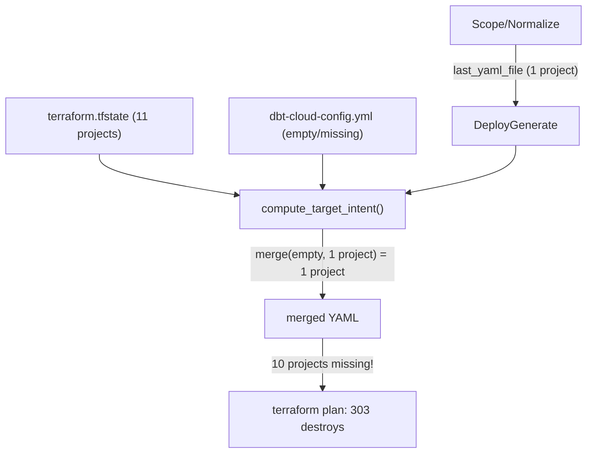
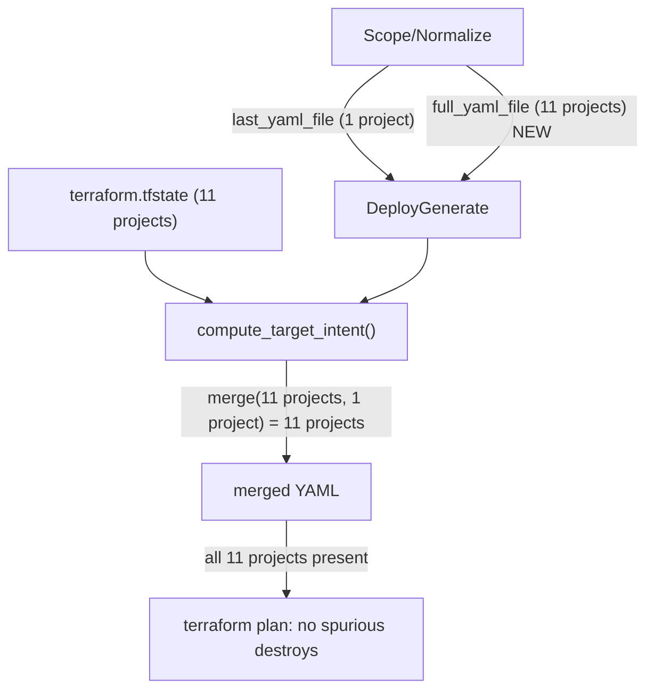

# Full Intent YAML Generation

## Problem

When the user selects only 1 project (`sse_dm_fin_fido`) in Scope/Normalize, the generated YAML only contains that project. The other 10 projects exist in TF state and target fetch, appear as confirmed state-only rows on the match grid, but their config never makes it into the generated `dbt-cloud-config.yml`. Terraform sees them as removed and plans to destroy 303 resources.

## Root Cause

The data pipeline has a gap:




In [target_intent.py](importer/web/utils/target_intent.py) line 515:

```python
merged = merge_yaml_configs(baseline_config, source_config)
```

When `baseline_config` is empty (no existing `dbt-cloud-config.yml`) and `source_config` only has 1 project, the merge produces a YAML with only 1 project. The 10 RETAINED projects get a coverage warning at line 527-528 but no config is generated for them.

## Fix Strategy: Full-Account YAML as Baseline Fallback

Generate a full-account normalized YAML (no scope exclusions) alongside the selected-scope YAML. Use this as a fallback baseline when no `dbt-cloud-config.yml` exists yet, so retained TF-state projects have config to merge from.




## Changes

### 1. State: Add `full_yaml_file` field

**File**: [importer/web/state.py](importer/web/state.py) ~line 495

Add `full_yaml_file: Optional[str] = None` to `MappingState` alongside `last_yaml_file`. Also add serialization/deserialization at lines ~1113 and ~1368.

### 2. Normalize: Produce full-account YAML

**File**: [importer/web/pages/mapping.py](importer/web/pages/mapping.py) ~line 1460

After the selected-scope normalize call, run a second `_do_normalize` with `exclude_by_type={}` (no exclusions) and a distinct output filename suffix (e.g. `_full`). Store the result in `state.map.full_yaml_file`.

This reuses the existing `_do_normalize` function and the same `state.fetch.last_fetch_file` input -- just without exclusions.

### 3. Deploy Generate: Pass full YAML as fallback baseline

**File**: [importer/web/pages/deploy.py](importer/web/pages/deploy.py) ~line 1323

Change the baseline resolution logic:

```python
# Current:
baseline_yaml = str(existing_yaml_path) if existing_yaml_path.exists() else None

# New: fall back to full-account YAML when no existing deployment YAML
if existing_yaml_path.exists():
    baseline_yaml = str(existing_yaml_path)
elif getattr(state.map, "full_yaml_file", None) and Path(state.map.full_yaml_file).exists():
    baseline_yaml = state.map.full_yaml_file
else:
    baseline_yaml = None
```

### 4. compute_target_intent: No changes needed

The existing logic at line 515 (`merge_yaml_configs(baseline_config, source_config)`) already does the right thing when baseline has all 11 projects:

- `merge_yaml_configs(full_11_projects, selected_1_project)` produces 11 projects, with the selected project's config overriding the full-account version
- The filter at line 518 keeps only `include_keys` (RETAINED + UPSERTED, excluding REMOVED/ORPHAN)
- Coverage warnings at line 527 no longer fire since all projects now have config

### 5. Tests

Add a test in `importer/web/tests/test_deploy_generate_merge.py` that verifies:

- When `baseline_yaml` is None but `full_yaml_file` is available, retained projects appear in merged output
- Source focus project config takes precedence over full-account config for the same key

## Key Files

- [importer/web/state.py](importer/web/state.py) -- `MappingState` dataclass
- [importer/web/pages/mapping.py](importer/web/pages/mapping.py) -- `_run_normalize` function
- [importer/web/pages/deploy.py](importer/web/pages/deploy.py) -- `_run_generate` function
- [importer/web/utils/target_intent.py](importer/web/utils/target_intent.py) -- `compute_target_intent` (no changes, but context)
- [importer/web/utils/adoption_yaml_updater.py](importer/web/utils/adoption_yaml_updater.py) -- `merge_yaml_configs` (no changes, but context)

