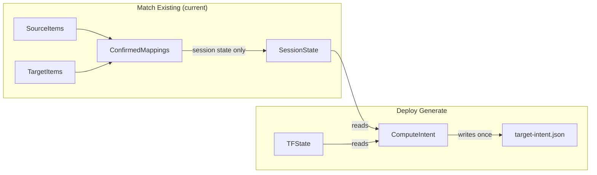
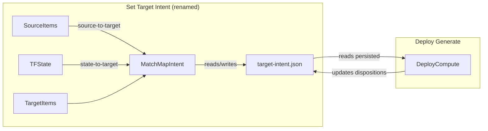

# Persistent Target Intent File

## Problem

Today `target-intent.json` is recomputed from scratch on every Deploy Generate. It lives in the deployment directory as a transient artifact, not as a persistent part of the project lifecycle. The Match page only shows selected source items matched to target -- TF state resources that aren't in the selected source set are completely invisible. There is no persistent file tracking the full picture of how source, TF state, and target relate to each other.

The `protection-intent.json` is already persistent and managed correctly; target intent should follow the same pattern.

The step is currently called "Match Existing" but that name is too narrow -- the step now handles adopt, remove, map, protect, and TF state alignment. Rename to "Set Target Intent" to reflect its expanded role.

## Current Architecture (what's wrong)




- `target-intent.json` is computed fresh each deploy and thrown away on the next
- Match page decisions (`confirmed_mappings`) live only in session state
- TF state resources not selected as source are invisible on Match page
- No persistent record of TF state-to-target alignment

## Proposed Architecture




## Changes

### 0. Rename "Match Existing" to "Set Target Intent"

The step label, icon, page header, subtitle, and all references need updating. The `WorkflowStep.MATCH` enum value stays the same (no code breakage), only the display label changes.

**Rename locations -- step label and page header:**


| File                                        | Line | Old                                                                          | New                                                                                  |
| ------------------------------------------- | ---- | ---------------------------------------------------------------------------- | ------------------------------------------------------------------------------------ |
| [state.py](importer/web/state.py)           | 54   | `"Match Existing"`                                                           | `"Set Target Intent"`                                                                |
| [state.py](importer/web/state.py)           | 78   | icon `"link"`                                                                | icon `"assignment"`                                                                  |
| [match.py](importer/web/pages/match.py)     | 143  | `"Match Source to Target Resources"`                                         | `"Set Target Intent"`                                                                |
| [match.py](importer/web/pages/match.py)     | 146  | `"Match source resources to existing target resources for Terraform import"` | `"Define what Terraform should manage: match, adopt, protect, and remove resources"` |
| [mapping.py](importer/web/pages/mapping.py) | 1840 | `"Match Existing Target Resources"`                                          | `"Set Target Intent"`                                                                |
| [deploy.py](importer/web/pages/deploy.py)   | 134  | comment: `Match Existing tab`                                                | comment: `Set Target Intent tab`                                                     |
| [deploy.py](importer/web/pages/deploy.py)   | 1414 | comment: `Match Existing tab`                                                | comment: `Set Target Intent tab`                                                     |
| [deploy.py](importer/web/pages/deploy.py)   | 1569 | user message: `Match Existing tab`                                           | user message: `Set Target Intent tab`                                                |


**Rename locations -- "Save Mapping File" section (match.py lines 4608-4706):**

The "Save Mapping File" button/section becomes "Save Target Intent". The existing `target_resource_mapping.yml` file and `save_mapping_file()` utility stay as-is under the hood (they still work), but the user-facing labels change. The "View Mapping" button stays visible and becomes "View Target Intent".


| File                                    | Line | Old                                       | New                                   |
| --------------------------------------- | ---- | ----------------------------------------- | ------------------------------------- |
| [match.py](importer/web/pages/match.py) | 4608 | comment: `Save mapping file section`      | comment: `Save target intent section` |
| [match.py](importer/web/pages/match.py) | 4618 | `"Save Mapping File"` (section heading)   | `"Save Target Intent"`                |
| [match.py](importer/web/pages/match.py) | 4684 | dialog title: `"Target Resource Mapping"` | `"Target Intent"`                     |
| [match.py](importer/web/pages/match.py) | 4692 | button: `"Save Mapping File"`             | `"Save Target Intent"`                |
| [match.py](importer/web/pages/match.py) | 4703 | button: `"View Mapping"`                  | `"View Target Intent"`                |


**Not renamed (historical docs):** `CHANGELOG.md`, `dev_support/importer_implementation_status.md` -- leave as-is since they reference past releases.

### 1. Promote TargetIntentManager to AppState (like ProtectionIntentManager)

**File: [importer/web/state.py**](importer/web/state.py)

Follow the exact `_protection_intent_manager` pattern (lines 832-875):

- Add `_target_intent_manager: Optional[TargetIntentManager]` field to `AppState`
- Add `get_target_intent_manager() -> TargetIntentManager` (lazy init, reads `{terraform_dir}/target-intent.json`)
- Add `save_target_intent()` method (saves if initialized)
- Not serialized in `to_dict()` -- manages its own file

### 2. Extend TargetIntentResult with match mappings

**File: [importer/web/utils/target_intent.py**](importer/web/utils/target_intent.py)

Add a `match_mappings` section to `TargetIntentResult` that tracks both dimensions:

- `**source_to_target**`: list of `{source_key, resource_type, target_id, target_name, match_type, action, confirmed, confirmed_at}` -- replaces the role of `confirmed_mappings` in session state
- `**state_to_target**`: list of `{state_key, state_address, resource_type, target_id, target_name, match_type, confirmed}` -- NEW: which TF state resource corresponds to which target resource

Bump version to 2. Keep backward compat: `from_dict` handles version 1 (no match_mappings).

Update `TargetIntentManager.save()` to **include** match_mappings (currently it strips `output_config` but should persist match data).

### 3. Match page reads/writes target intent on user actions

**File: [importer/web/pages/match.py**](importer/web/pages/match.py)

When the Match page loads:

- Call `state.get_target_intent_manager()` to load the persistent file
- Use persisted `match_mappings.source_to_target` as the source for `confirmed_mappings` grid state (instead of pure session state)
- Use persisted `match_mappings.state_to_target` to show TF state alignment

When the user confirms/rejects a mapping:

- Update the intent file immediately (not just session state)
- Existing `save_state()` calls should also call `state.save_target_intent()`

When TF state is loaded (the "Load TF State" button, around line 1169):

- Compute `state_to_target` matches by correlating `state_result.resources` with `target_items` (by dbt_id, name, etc.)
- Persist these to the intent file's `match_mappings.state_to_target`

### 4. Show TF state resources on Match page (not just source)

**File: [importer/web/pages/match.py](importer/web/pages/match.py) and [importer/web/components/match_grid.py**](importer/web/components/match_grid.py)

Add a new section to the Match page (after the existing source-to-target grid) that shows TF state resources and their target matches:

- Read `state_to_target` from the persisted intent
- Show a table/panel: State Key | State Address | Target Match | Status (matched/unmatched/orphan)
- This gives visibility into the 10 project keys that were being flagged as orphans
- Include a stat card for "State Resources" count alongside existing Pending/Confirmed/etc.

Alternatively, extend `build_grid_data()` to also emit rows for state-only resources (not in source set) so they appear in the same grid with a distinct visual treatment.

### 5. Add "Target Intent" tab to resource detail dialog

**File: [importer/web/components/entity_table.py](importer/web/components/entity_table.py) (lines 1366-1577)**

The `show_match_detail_dialog` already has 6 tabs: Drift/Compare, Source Details, Target Details, TF State, JSON, Match Debug. Add a new **"Target Intent"** tab (icon: `assignment`) between TF State and JSON.

This tab shows the resource's disposition from the persisted `target-intent.json`:

- **Disposition**: retained / upserted / adopted / removed / orphan_flagged / orphan_retained -- with color badge
- **Source of disposition**: tf_state_default, source_focus, adopt_rows, removal_intent, orphan_detection
- **Confirmed**: whether the user confirmed this disposition, and when
- **State-to-target match**: which target resource this state key maps to (from `match_mappings.state_to_target`)
- **Protection intent summary**: current protection_intent status (already exists in Drift/Compare around line 1913, but a concise summary here keeps it in one place)

Pass the `TargetIntentResult` (or the relevant `ResourceDisposition`) into `show_match_detail_dialog` via the existing `app_state` parameter -- the dialog can call `app_state.get_target_intent_manager().load()` to get the intent data and look up the disposition for this resource's key.

**No changes to protection intent** -- the existing protection status display in the Drift/Compare tab (lines 1913-1938) stays untouched. The Target Intent tab just provides a read-only summary alongside the other disposition info.

### 6. Deploy reads persistent intent (not recompute from scratch)

**File: [importer/web/pages/deploy.py](importer/web/pages/deploy.py) (lines 1297-1343)**

Change deploy generate to:

1. Load existing intent via `state.get_target_intent_manager()` (already has persisted user decisions)
2. Recompute dispositions but **preserve confirmed match_mappings** from the persistent file
3. Merge new source focus and adopt rows into existing dispositions
4. Save updated intent back

This is partially done already (`previous_intent = intent_manager.load()` at line 1321 and confirmed dispositions are preserved), but the match_mappings should also be preserved.

### 6. Sync confirmed_mappings with intent file

Keep `state.map.confirmed_mappings` in session state as the in-memory working copy (the grid needs it), but the persistent source of truth becomes `target-intent.json`. On load, if the intent file has `match_mappings.source_to_target`, populate `confirmed_mappings` from it. On save, write confirmed_mappings back to the intent file.

This means `target_resource_mapping.yml` (the optional "Save Mapping File" export) becomes a convenience export, not the persistence mechanism.

## Protection Intent: No Changes

Protection intent (`protection-intent.json` / `ProtectionIntentManager`) is **not modified** in this plan. It already follows the correct pattern (persistent file, lazy-loaded, UI-managed). The existing protection display in the resource detail dialog Drift/Compare tab (lines 1913-1938 of entity_table.py) stays untouched. The new Target Intent tab provides a read-only summary of protection status alongside the disposition data.

## Key Files

- [importer/web/utils/target_intent.py](importer/web/utils/target_intent.py) -- data model changes (match_mappings)
- [importer/web/state.py](importer/web/state.py) -- add `_target_intent_manager` (like `_protection_intent_manager`)
- [importer/web/pages/match.py](importer/web/pages/match.py) -- read/write intent, show state-to-target, rename labels
- [importer/web/components/match_grid.py](importer/web/components/match_grid.py) -- optional: state-only rows
- [importer/web/components/entity_table.py](importer/web/components/entity_table.py) -- new Target Intent tab in detail dialog
- [importer/web/pages/deploy.py](importer/web/pages/deploy.py) -- read persistent intent, preserve match_mappings
- [importer/web/tests/test_target_intent.py](importer/web/tests/test_target_intent.py) -- new tests for match_mappings

## File on disk

```
deployments/migration/
  target-intent.json        # persistent, read/written by Match + Deploy
  protection-intent.json    # persistent, read/written by Match + Utilities
  terraform.tfstate          # TF manages this
  dbt-cloud-config.yml       # generated YAML
```

