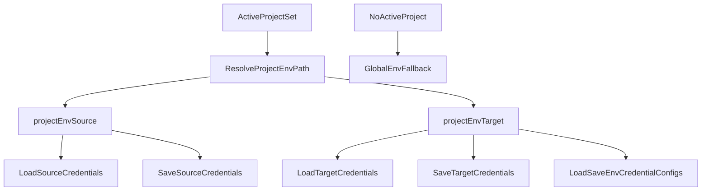

# Project-Scoped Credential Storage Plan

## Goal

Keep source/target credentials with the active project folder (`projects/{slug}`), eliminate accidental cross-project `.env` reuse, and add regression tests for all credential load/save entry points.

## Current state (confirmed)

- Credential load/save defaults to upward `.env` discovery via `[/Users/operator/Documents/git/dbt-labs/terraform-dbtcloud-yaml/importer/web/env_manager.py](/Users/operator/Documents/git/dbt-labs/terraform-dbtcloud-yaml/importer/web/env_manager.py)` (`find_env_file()`, `load_*_credentials()`, `save_*_credentials()`).
- Project-scoped credential files already exist in the model (`.env.source`, `.env.target`) in `[/Users/operator/Documents/git/dbt-labs/terraform-dbtcloud-yaml/importer/web/project_manager.py](/Users/operator/Documents/git/dbt-labs/terraform-dbtcloud-yaml/importer/web/project_manager.py)`, but most UI pages do not pass explicit `env_path`.
- Affected pages include:
  - `[/Users/operator/Documents/git/dbt-labs/terraform-dbtcloud-yaml/importer/web/pages/fetch_source.py](/Users/operator/Documents/git/dbt-labs/terraform-dbtcloud-yaml/importer/web/pages/fetch_source.py)`
  - `[/Users/operator/Documents/git/dbt-labs/terraform-dbtcloud-yaml/importer/web/pages/fetch_target.py](/Users/operator/Documents/git/dbt-labs/terraform-dbtcloud-yaml/importer/web/pages/fetch_target.py)`
  - `[/Users/operator/Documents/git/dbt-labs/terraform-dbtcloud-yaml/importer/web/pages/target_credentials.py](/Users/operator/Documents/git/dbt-labs/terraform-dbtcloud-yaml/importer/web/pages/target_credentials.py)`
  - `[/Users/operator/Documents/git/dbt-labs/terraform-dbtcloud-yaml/importer/web/workflows/jobs_as_code/pages/fetch.py](/Users/operator/Documents/git/dbt-labs/terraform-dbtcloud-yaml/importer/web/workflows/jobs_as_code/pages/fetch.py)`
  - `[/Users/operator/Documents/git/dbt-labs/terraform-dbtcloud-yaml/importer/web/workflows/jobs_as_code/pages/target.py](/Users/operator/Documents/git/dbt-labs/terraform-dbtcloud-yaml/importer/web/workflows/jobs_as_code/pages/target.py)`
  - Plus legacy/unrouted modules requested in scope-all-pages: `[/Users/operator/Documents/git/dbt-labs/terraform-dbtcloud-yaml/importer/web/pages/fetch.py](/Users/operator/Documents/git/dbt-labs/terraform-dbtcloud-yaml/importer/web/pages/fetch.py)`, `[/Users/operator/Documents/git/dbt-labs/terraform-dbtcloud-yaml/importer/web/pages/target.py](/Users/operator/Documents/git/dbt-labs/terraform-dbtcloud-yaml/importer/web/pages/target.py)`

## Proposed design

1. **Centralize env-path resolution in one helper**
  - Add a small resolver in `[/Users/operator/Documents/git/dbt-labs/terraform-dbtcloud-yaml/importer/web/env_manager.py](/Users/operator/Documents/git/dbt-labs/terraform-dbtcloud-yaml/importer/web/env_manager.py)` that:
    - Uses project-scoped paths when `state.active_project` / `state.project_path` is present.
    - Returns source path (`.env.source`) or target path (`.env.target`) per context.
    - Falls back to global `.env` only when no active project exists.
2. **Implement your fallback preference (auto-seed + explicit import option)**
  - When a project is active and project env file is missing:
    - Auto-seed from discovered root `.env` if matching keys exist.
    - Provide a dialog path in load action to import credentials into project files (explicit user-controlled option) when needed.
  - Ensure save actions always write to the project file when a project is active.
3. **Wire every credential load/save call site to explicit env paths**
  - Update all pages listed above to pass `env_path` explicitly for load/save and env credential config functions.
  - For env-credentials step (`target_credentials`), scope both read (`load_env_credential_config`) and write (`save_env_credential_config`) to the project target env file.
  - Keep upload-based credential loading unchanged (explicit file content should still map into state, then save uses project path).
4. **Refresh account metadata from project-scoped files**
  - Update startup/project-load account refresh in `[/Users/operator/Documents/git/dbt-labs/terraform-dbtcloud-yaml/importer/web/app.py](/Users/operator/Documents/git/dbt-labs/terraform-dbtcloud-yaml/importer/web/app.py)` so `load_account_info_from_env()` uses project-scoped env paths when an active project exists.

## Data flow (after change)

## Test strategy (regression-focused)

- Extend existing project manager tests in `[/Users/operator/Documents/git/dbt-labs/terraform-dbtcloud-yaml/importer/web/tests/test_project_manager.py](/Users/operator/Documents/git/dbt-labs/terraform-dbtcloud-yaml/importer/web/tests/test_project_manager.py)`:
  - Verify project env file paths resolve deterministically.
  - Verify missing project env auto-seed behavior from root `.env` (source and target variants).
- Add focused env/path tests in `[/Users/operator/Documents/git/dbt-labs/terraform-dbtcloud-yaml/test/test_env_credentials.py](/Users/operator/Documents/git/dbt-labs/terraform-dbtcloud-yaml/test/test_env_credentials.py)`:
  - Project-scoped load/save uses explicit project env paths and does not touch global `.env`.
  - Environment credential config read/write is project-scoped when path supplied.
- Add new page-level regression tests (new file under `importer/web/tests`, e.g. `test_project_credential_scoping.py`):
  - Patch env-manager functions and assert each page helper passes the expected `env_path`.
  - Cover migration, jobs-as-code, and legacy modules in-scope (`all_pages`).

## Verification

- Run targeted tests for changed areas first, then broader suites:
  - `pytest importer/web/tests/test_project_manager.py -v`
  - `pytest test/test_env_credentials.py -v`
  - `pytest importer/web/tests/test_project_credential_scoping.py -v` (new)
- Optional sanity UI check in browser MCP after implementation:
  - Create/load two projects with different creds and verify “Load .env”/“Save .env” stay isolated per project.

