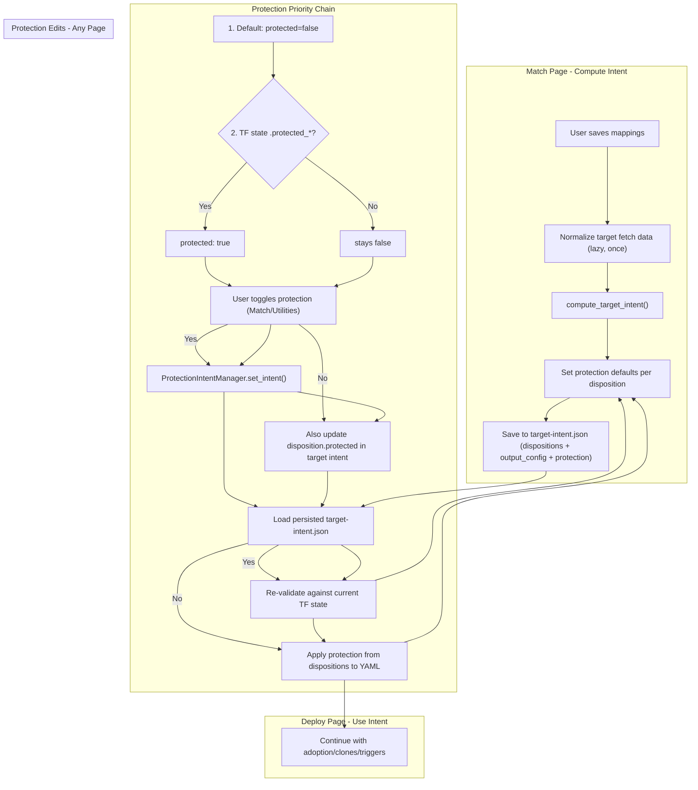

# Target Intent as Authoritative Project State File

## Problem

Target intent is currently fragmented across three disconnected systems:

1. **Match page** saves only `match_mappings` to `target-intent.json`
2. **Deploy page** recomputes `compute_target_intent()` from scratch with insufficient inputs -- `source_focus_yaml` has only selected projects, `baseline_yaml` is often empty, so retained projects get no config and Terraform plans ~300 destroys
3. **Protection intent** lives in a separate `protection-intent.json` with its own manager, disconnected from the resource dispositions that drive YAML generation

## Solution

Make `target-intent.json` THE single authoritative state file. It contains:

- **Dispositions** (retained, upserted, adopted, removed, orphan) with per-resource `protected` field
- **output_config** (the merged YAML dict, embedded in JSON)
- **match_mappings** (source-to-target and state-to-target mappings)

Protection is a property OF each disposition, not a separate system. Default: `protected: false` unless the resource is already protected in TF state.




## Key Architectural Changes

### 1. Target baseline YAML (solves the "retained projects have no config" gap)

Normalize the target fetch snapshot (same normalizer used for source) to produce a YAML with ALL target projects. This becomes the `baseline_yaml` for `compute_target_intent`, ensuring every retained project has config in `output_config`.

### 2. Protection as a disposition property (unifies protection + target intent)

Add `protected: bool = False` to `ResourceDisposition`. When computing target intent, protection is resolved via a 4-level priority chain: (1) default false, (2) TF state `.protected_` override, (3) existing `protection-intent.json` entries, (4) user edits in previous target intent. This makes every resource's protection decision explicit. The `ProtectionIntentManager` continues to handle the UI/edit workflow but syncs edits back into the disposition.

## Implementation

### 1. Add `protected` field to `ResourceDisposition`

**File:** [importer/web/utils/target_intent.py](importer/web/utils/target_intent.py)

- Add `protected: bool = False` to the `ResourceDisposition` dataclass
- Add `protection_set_by: Optional[str] = None` (tracks source: "tf_state_default", "user", "bulk_action")
- Add `protection_set_at: Optional[str] = None`
- Ensure `to_dict()` / `from_dict()` serialize these fields

### 2. Set protection via priority chain in `compute_target_intent()`

**File:** [importer/web/utils/target_intent.py](importer/web/utils/target_intent.py) -- inside `compute_target_intent()`

After building dispositions (line ~472), apply protection using a 4-level priority chain:

**Priority (lowest to highest):**

1. Default: `protected: false`
2. TF state: `.protected_` in state address -> `protected: true`
3. Protection intent file: existing `protection-intent.json` entry overrides
4. User edit in previous target intent: `protection_set_by == "user"` in `previous_intent`

```python
# Accept optional protection_intent_manager parameter
# Level 1: Default - all false
for key, disp in dispositions.items():
    disp.protected = False
    disp.protection_set_by = "default_unprotected"

# Level 2: TF state override
for key, disp in dispositions.items():
    tf_addr = disp.tf_state_address or ""
    if ".protected_" in tf_addr:
        disp.protected = True
        disp.protection_set_by = "tf_state_default"

# Level 3: Protection intent file override
if protection_intent_manager:
    for key, disp in dispositions.items():
        intent = protection_intent_manager.get_intent(key)
        if intent is not None:
            disp.protected = intent.protected
            disp.protection_set_by = "protection_intent"

# Level 4: User edits from previous target intent (highest priority)
if previous_intent:
    for k, prev_disp in previous_intent.dispositions.items():
        if k in dispositions and prev_disp.protection_set_by == "user":
            dispositions[k].protected = prev_disp.protected
            dispositions[k].protection_set_by = prev_disp.protection_set_by
            dispositions[k].protection_set_at = prev_disp.protection_set_at
```

This requires passing `protection_intent_manager` as a new optional parameter to `compute_target_intent()`.

### 3. Add `target_baseline_yaml` field to `TargetFetchState`

**File:** [importer/web/state.py](importer/web/state.py)

- Add `target_baseline_yaml: Optional[str] = None` to `TargetFetchState` (line ~220)
- Add serialization in `to_dict()` (line ~1087) and deserialization in `from_dict()` (line ~1368)

### 4. Create `normalize_target_fetch()` utility

**File:** [importer/web/utils/target_intent.py](importer/web/utils/target_intent.py) (new function)

- Checks if `state.target_fetch.target_baseline_yaml` already points to an existing file
- If not, calls `_do_normalize(state.target_fetch.last_fetch_file, exclude_by_type={}, output_dir)` to produce a full-account YAML from the target fetch snapshot
- Caches the result path in `state.target_fetch.target_baseline_yaml`
- Reuses the existing generic normalizer from [importer/web/pages/mapping.py](importer/web/pages/mapping.py) lines 1519-1616

### 5. Make `TargetIntentManager` persist `output_config`

**File:** [importer/web/utils/target_intent.py](importer/web/utils/target_intent.py)

- `save()` (line 584): Stop dropping `output_config` from persisted data
- `load()` (line 569): Restore `output_config` from file instead of setting it to `{}`

### 6. Compute full target intent on the Match page

**File:** [importer/web/pages/match.py](importer/web/pages/match.py) (line 246)

Enhance `_persist_target_intent_from_match()` to:

1. Call `normalize_target_fetch(state)` to get the target baseline YAML
2. Gather all inputs: `source_focus_yaml`, `tfstate_path`, `target_report_items`, `removal_keys`
3. Call `compute_target_intent()` with `baseline_yaml=target_baseline_yaml` -- this now computes dispositions with protection defaults + merged output_config
4. Merge match_mappings from the grid into the result
5. Save the complete `TargetIntentResult` via `state.save_target_intent()`

May need to become `async` since normalization involves I/O. Callers already use async handlers.

### 7. Deploy page reads persisted intent + applies protection from dispositions

**File:** [importer/web/pages/deploy.py](importer/web/pages/deploy.py) (line 1296)

In `_run_generate`:

1. Load persisted intent from `TargetIntentManager`
2. If `output_config` is populated:
  - Re-validate against current TF state (warn if stale)
  - Write `output_config` to `dbt-cloud-config-merged.yml`
  - **Apply protection from dispositions**: build `protected_resources` and `unprotected_keys` sets directly from `dispositions[key].protected` instead of from the separate `ProtectionIntentManager`
  - Continue with adoption overrides, clones, triggers, etc.
3. If `output_config` is missing: fall back to current recompute behavior

### 8. Write-through: protection edits update protection-intent.json first, then target intent

**Files:** [importer/web/pages/match.py](importer/web/pages/match.py), [importer/web/pages/utilities.py](importer/web/pages/utilities.py), [importer/web/components/entity_table.py](importer/web/components/entity_table.py)

When users toggle protection via the existing UI (protect/unprotect buttons, bulk actions, clarification panels), the write order is strict:

1. **First**: `ProtectionIntentManager.set_intent()` writes to `protection-intent.json` -- this is the immediate record of the user's decision
2. **Second**: Load the persisted target intent, update the corresponding `ResourceDisposition.protected` (set `protection_set_by="user"`, `protection_set_at=now`), save target intent
3. **Then**: Proceed with any other UI updates (grid refresh, notifications, etc.)

This ordering ensures `protection-intent.json` is always up to date before any downstream step runs. The target intent disposition mirrors it as the consolidated deployment record.

### 9. Tests

- Protection defaults: verify `protected=false` for normal resources, `protected=true` for `.protected_` TF state addresses
- User override preservation: verify that `protection_set_by="user"` survives recomputation
- `output_config` round-trip: verify `TargetIntentManager.save/load` preserves it
- Retained project config: verify retained projects have YAML config when target baseline is provided
- Deploy reads persisted intent: verify deploy uses `output_config` and applies protection from dispositions

