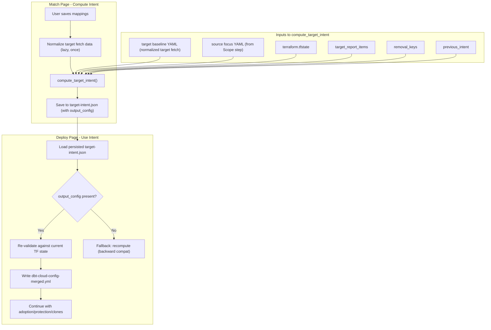

# Target Intent as Authoritative Project State File

## Problem

Currently, target intent is split across two disconnected flows:

- **Match page** saves only `match_mappings` (confirmed_mappings + state_to_target) to `target-intent.json`
- **Deploy page** recomputes `compute_target_intent()` from scratch, but receives insufficient inputs: `source_focus_yaml` contains only the selected project(s), `baseline_yaml` is often empty, so retained projects (in TF state + target fetch but not selected) get **no config** in the merged YAML, causing Terraform to plan ~300 destroys

## Solution

Make `target-intent.json` a self-contained state file computed on the Match page. The Deploy page reads and validates the persisted intent.

## Key Architectural Change

The **missing piece** is a "target baseline YAML": normalize the target fetch snapshot (same normalizer used for source) to produce a YAML with all target projects. This becomes the `baseline_yaml` for `compute_target_intent`, ensuring retained projects have config.

## Implementation

### 1. Add `target_baseline_yaml` field to `TargetFetchState`

**File:** [importer/web/state.py](importer/web/state.py)

- Add `target_baseline_yaml: Optional[str] = None` to `TargetFetchState` (line ~220)
- Add serialization in `to_dict()` (line ~1087) and deserialization in `from_dict()` (line ~1368)

### 2. Create `normalize_target_fetch()` utility

**File:** [importer/web/utils/target_intent.py](importer/web/utils/target_intent.py) (new function)

Add a function that:

- Checks if `state.target_fetch.target_baseline_yaml` already exists and the file is valid
- If not, calls `_do_normalize(state.target_fetch.last_fetch_file, exclude_by_type={}, output_dir)` to produce a full-account YAML from the target fetch data
- Stores the result path in `state.target_fetch.target_baseline_yaml`
- Returns the path

This reuses the existing generic normalizer (`_do_normalize` from [importer/web/pages/mapping.py](importer/web/pages/mapping.py) lines 1519-1616). The normalizer is already generic (works on any `AccountSnapshot`).

### 3. Make `TargetIntentManager` persist `output_config`

**File:** [importer/web/utils/target_intent.py](importer/web/utils/target_intent.py)

- `save()` (line 584): Stop dropping `output_config` from persisted data
- `load()` (line 569): Restore `output_config` from file instead of setting it to `{}`

### 4. Enhance `_persist_target_intent_from_match()` to compute full intent

**File:** [importer/web/pages/match.py](importer/web/pages/match.py) (line 246)

Currently saves only match_mappings. Enhance to:

1. Call `normalize_target_fetch(state)` to get the target baseline YAML
2. Gather all inputs: `source_focus_yaml` from `state.map.last_yaml_file`, `tfstate_path` from deployment dir, `target_report_items`, `removal_keys`, etc.
3. Call `compute_target_intent()` with `baseline_yaml=target_baseline_yaml`
4. Merge the match_mappings from the grid into the result
5. Save the complete `TargetIntentResult` (with `output_config`) via `state.save_target_intent()`

This function may need to become `async` since normalization involves I/O. Callers already use async handlers.

### 5. Modify Deploy page to use persisted intent

**File:** [importer/web/pages/deploy.py](importer/web/pages/deploy.py) (line 1296)

In `_run_generate`:

1. Load `previous_intent` from `TargetIntentManager`
2. If `previous_intent.output_config` is populated:
  - Re-validate: check TF state hasn't changed since `computed_at` timestamp
  - Warn if stale (new/removed TF state keys since computation)
  - Use `previous_intent.output_config` directly: write to `dbt-cloud-config-merged.yml`
  - Skip the full `compute_target_intent()` recomputation
3. If `output_config` is empty or intent is missing: fall back to current behavior (recompute)
4. Continue with existing downstream steps (adoption overrides, protection, clones, etc.)

### 6. Tests

- Test that normalized target YAML is produced correctly from target fetch data
- Test that `TargetIntentManager.save/load` round-trips `output_config`
- Test that retained projects have config in the persisted `output_config`
- Test that Deploy page uses persisted intent when available and falls back when not

